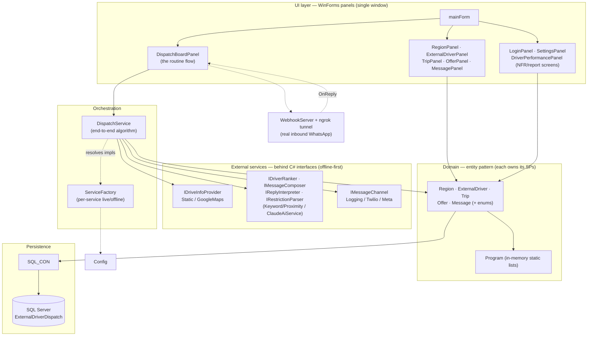
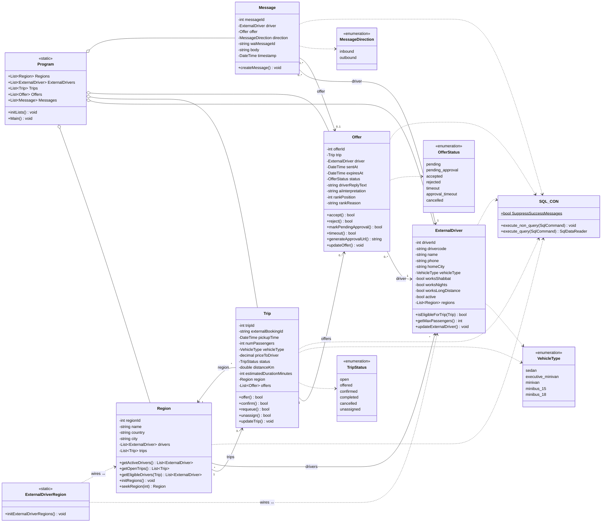
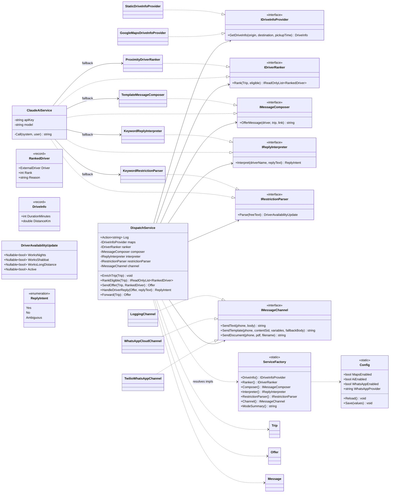
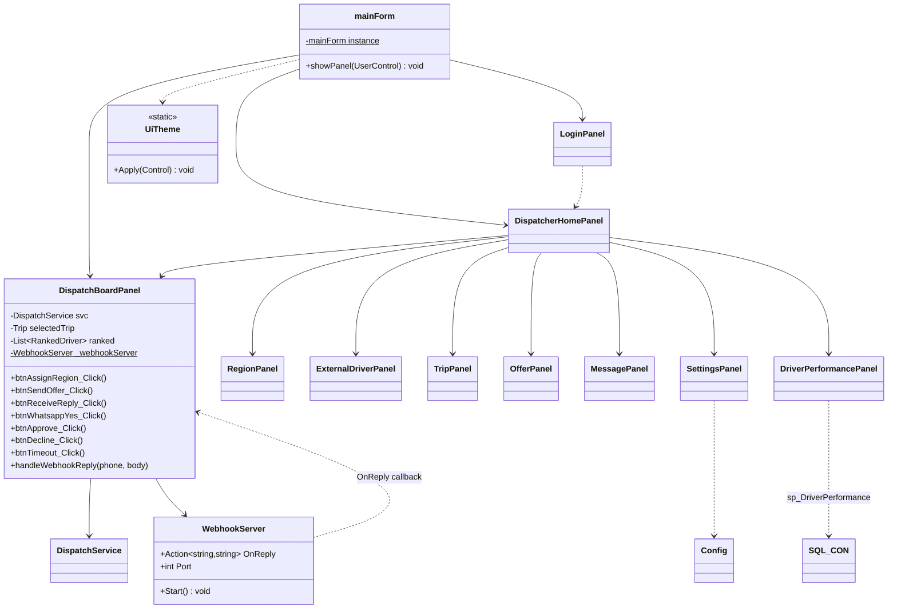
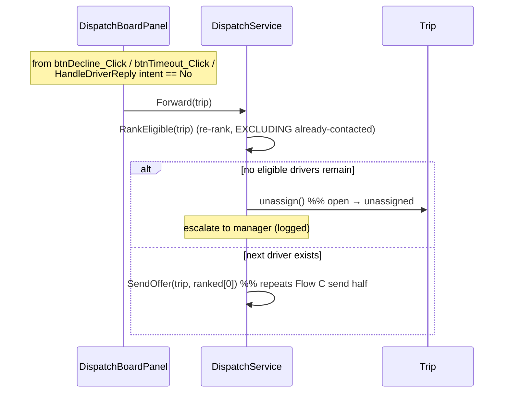
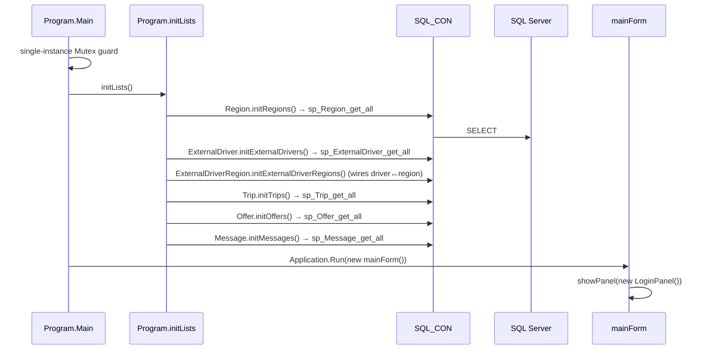

# Implementation UML — As-Built (reverse-engineered from the C# code)

> **What this is.** This document mirrors the code in `ExternalDriverDispatch/` *exactly as written*,
> not the clean analysis model. It is the **design/implementation** companion to the analysis-level
> [class-diagram.md](class-diagram.md). The analysis diagram answers *"what entities exist and why"*;
> this one answers *"how is the running program actually wired"* — so it deliberately includes the
> things the analysis diagram leaves out: the WinForms **panels**, the three external **`«service»`
> classes behind interfaces**, the `DispatchService` orchestrator, and the infrastructure
> (`Program` in-memory lists, `SQL_CON`, `Config`, `ServiceFactory`, `WebhookServer`).
>
> **Scope note.** Getters/setters and pure CRUD plumbing are omitted from the class boxes for
> legibility; the state-machine verbs, domain operations, and service entry points are kept because
> the flows run through them. The class model is split into three layers (Domain · Services · UI/Infra)
> for readability — it is one model, drawn in three connected views, followed by a layer-dependency
> overview and a sequence diagram per flow.

---

## Legend

| Notation | Meaning |
|---|---|
| `..|>` | realizes an interface (`class ..|> IInterface`) |
| `-->` | association / holds a reference (multiplicity + role on the line) |
| `..>` | dependency (calls / uses, no stored reference) |
| `o--` | aggregation (the `Program` static lists own the entity instances) |
| `<<interface>>` / `<<enumeration>>` / `<<record>>` / `<<static>>` | stereotype |
| 🟦 blue fill | **course-obligated** class (see Obligation tiers below) |
| 🟧 amber fill | **extra** class we added beyond the assignment |

---

## Obligation tiers — what the course requires vs. what we added

**Everything we built is shown in full** in this document (the whole system as-built). The colour/box
tells you which part the course rules oblige us to have, and which part is an enhancement we added.

| Tier | Colour | What it is |
|---|---|---|
| 🟦 **Course-obligated** | blue | In the submitted Part B class diagram, or required by the SAD architecture rules (`PATTERNS.md`): the 5 entities, 4 enums, the `RideControlSystem` «interface», the 3 service **abstractions** (their interfaces), the entity-pattern infra (`SQL_CON`, `Program`, `mainForm`, `LoginPanel`/`DispatcherHomePanel`, the 4 entity CRUD panels), and the 6 use-case flows. |
| 🟧 **Extra (we added)** | amber | Beyond the assignment: the live integrations (`GoogleMapsDriveInfoProvider`, `ClaudeAiService`, `TwilioWhatsAppChannel`, `WhatsAppCloudChannel`) **and** their offline fallbacks, the `DispatchService` orchestrator, `ServiceFactory`, `Config`, the integrated `DispatchBoardPanel`, `WebhookServer` + ngrok tunnel, `SettingsPanel`, `DriverPerformancePanel` (+ `sp_DriverPerformance`), `MessagePanel`, and `UiTheme`. |

> **Boundary rule.** *Is the class in the submitted Part B class diagram, or mandated by `PATTERNS.md`?*
> Yes → 🟦 obligated. If it exists only to make the system **smart, real, or polished** (external APIs,
> AI, the integrated board, reports, settings, theming) → 🟧 extra. The service **interfaces** are 🟦
> (they are the modelled «service» boundary); their **concrete implementations** are 🟧 (the actual API
> plumbing the course does not require us to model).

```mermaid
flowchart TB
  subgraph OB["🟦 COURSE-OBLIGATED — required by the Part B model + PATTERNS.md"]
    direction TB
    obEnt["Entities: Region · ExternalDriver · Trip · Offer · Message"]
    obEnum["Enums: VehicleType · TripStatus · OfferStatus · MessageDirection"]
    obIface["RideControlSystem «interface» (external contract)"]
    obSvcIface["Service abstractions (interfaces): IDriveInfoProvider · IDriverRanker ·<br/>IMessageComposer · IReplyInterpreter · IRestrictionParser · IMessageChannel"]
    obInfra["Entity-pattern infra: SQL_CON · Program · mainForm · LoginPanel ·<br/>DispatcherHomePanel · RegionPanel · ExternalDriverPanel · TripPanel · OfferPanel"]
    obUC["6 UC flows: View Open Trips · Assign Trip to Region · Send Trip Offer (UC17) ·<br/>Respond to Trip Offer (UC07) · Forward Offer · Update Ride Control (UC08)"]
  end
  subgraph EX["🟧 EXTRA — enhancements we added (not required to model)"]
    direction TB
    exOrch["Orchestration: DispatchService · ServiceFactory · Config"]
    exLive["Live integrations: GoogleMapsDriveInfoProvider · ClaudeAiService ·<br/>TwilioWhatsAppChannel · WhatsAppCloudChannel"]
    exFall["Offline fallbacks: StaticDriveInfoProvider · ProximityDriverRanker · TemplateMessageComposer ·<br/>KeywordReplyInterpreter · KeywordRestrictionParser · LoggingChannel"]
    exBoard["Integrated UI: DispatchBoardPanel · MessagePanel"]
    exReal["Real inbound: WebhookServer + ngrok tunnel + Twilio webhook auto-update"]
    exReport["Reports: DriverPerformancePanel + sp_DriverPerformance"]
    exSettings["Settings: SettingsPanel (per-service live/offline)"]
    exTheme["Visual design: UiTheme"]
  end
  classDef ob fill:#DBEAFE,stroke:#2563EB,color:#1E3A8A;
  classDef ex fill:#FEF3C7,stroke:#D97706,color:#7C2D12;
  class obEnt,obEnum,obIface,obSvcIface,obInfra,obUC ob;
  class exOrch,exLive,exFall,exBoard,exReal,exReport,exSettings,exTheme ex;
```



---

## 0. Layer dependency overview

How the layers depend on each other at runtime. Arrows point in the direction of a call/dependency.



---

## 1. Domain model (entities · enums · in-memory store · DB gateway)

The entity pattern as actually coded: each entity owns its `create/update/delete/init/seek/getNext`
and its **state-machine verbs**; all DB access goes through `SQL_CON`; all instances live in
`Program.*` static lists after `initLists()`.



> 🟦 **The entire domain layer is course-obligated** — these are exactly the entities, enums and
> entity-pattern infra the assignment and `PATTERNS.md` require. Nothing here is extra.

**As-built facts this captures**
- `ExternalDriverRegion` is **not** an entity — it is a `static` loader that only *wires* the
  `ExternalDriver ↔ Region` object references in memory (the many-to-many has no attributes).
- PKs are assigned in C# (`getNextXyzId()` = `max(id)+1`), never `IDENTITY`.
- State lives on `Trip.status` / `Offer.status`; the verbs guard the transition in C# **and** call a
  transactional SP. `Offer.accept/reject/timeout` also mutate the linked `Trip` (dual-entity transaction).

---

## 2. External services layer (interfaces · offline fallbacks · live impls · orchestrator)



> 🟦 The six **interfaces** are the modelled «service» boundary (course-obligated). 🟧 Everything else
> in this layer — the concrete offline fallbacks, the live API clients, and the `DispatchService`
> orchestrator + `ServiceFactory`/`Config` wiring — is the extra we added to make the system smart and real.

**As-built facts this captures**
- Every interface has a **deterministic offline fallback**; `ServiceFactory` returns the live impl
  only when that service's own `*.Enabled` flag is on **and** its credentials exist. No global switch.
- `ClaudeAiService` implements all four AI roles and, on any exception, **delegates to the matching
  keyword/proximity/template fallback** — a missing key degrades a feature, never crashes.
- `DispatchService` is the only place the six services compose into one algorithm; the UI never
  touches a service or the network directly. (This is a service layer for *external APIs only* — it is
  **not** a DAL; entities still own their own DB methods.)

---

## 3. UI / infrastructure layer (single-window panel navigation)



> 🟦 The single-window shell, login/home navigation, and the 4 entity CRUD panels are the obligated
> infrastructure. 🟧 The integrated `DispatchBoardPanel`, the `MessagePanel` audit viewer, `SettingsPanel`,
> the `DriverPerformancePanel` report, `WebhookServer`, and `UiTheme` are extra. (Note: the 6 UC *flows*
> are obligated even though the board they run on is extra — the same flows are reachable from the CRUD
> panels' verb buttons.)

**As-built facts this captures**
- One window (`mainForm.panelMain`); `showPanel(new XyzPanel())` swaps the active `UserControl`.
- `LoginPanel`, `SettingsPanel`, `DriverPerformancePanel` are **technical/NFR screens** — not UCs or
  entities (Login uses a dev placeholder password; Settings writes `Config`; the report is DB-only).
- The real inbound WhatsApp path (`WebhookServer` + ngrok) is **app-scoped static**, started once and
  re-pointed at whichever board is visible.

---

# Sequence diagrams — one per flow

The six in-scope flows, traced through the **real** call path. Stored-procedure names and state
transitions are exactly those in the code.

## Flow A — View Open Trips  *(entry point)*

**Tier: 🟦 course UC.** Shown here on the 🟧 extra `DispatchBoardPanel`, but the same open-trips data is
also viewable on the obligated `TripPanel`.

No DB round-trip: the queue is rendered from the in-memory `Program.Trips` loaded at startup.

```mermaid
sequenceDiagram
    actor D as Dispatcher
    participant Board as DispatchBoardPanel
    participant Prog as Program (in-memory)
    participant Trip

    Note over Board: ctor → UiTheme.Apply, svc.Log=log,<br/>refreshRegionCombo(), loadTrips()
    Board->>Prog: iterate Program.Trips
    Note over Board: keep status ∈ {open, offered, unassigned}<br/>bind DataTable → dgvTrips
    D->>Board: click a trip row (dgvTrips_CellClick)
    Board->>Trip: seekTrip(id)
    Board->>Board: selectedTrip = trip<br/>refreshDrivers(); refreshOffers()
```

## Flow B — Assign Trip to Region  *(includes Maps enrichment)*

**Tier: 🟦 course UC.** Obligated core = set the trip's region + `sp_Trip_update`. 🟧 Extra step inside =
the `svc.EnrichTrip` Maps call (distance/ETA) — pure enhancement; the flow still completes with the
offline fallback (60 min / 0 km).

```mermaid
sequenceDiagram
    actor D as Dispatcher
    participant Board as DispatchBoardPanel
    participant Trip
    participant SC as SQL_CON
    participant DB as SQL Server
    participant Svc as DispatchService
    participant Maps as IDriveInfoProvider

    D->>Board: select region + "Assign region" (btnAssignRegion_Click)
    Board->>Trip: setRegion(region)
    Board->>Trip: updateTrip()  (quiet)
    Trip->>SC: execute_non_query(sp_Trip_update)
    SC->>DB: EXEC sp_Trip_update
    Board->>Svc: EnrichTrip(trip)
    Svc->>Maps: GetDriveInfo(pickup, dropoff, pickupTime)
    Note over Maps: offline → StaticDriveInfoProvider (60 min / 0 km)<br/>live → GoogleMapsDriveInfoProvider (Distance Matrix)
    Maps-->>Svc: DriveInfo(min, km)
    Svc->>Trip: setDistanceKm / setEstimatedDurationMinutes
    Svc->>Trip: updateTrip()  (quiet) → sp_Trip_update
    Note over Svc: distanceKm ≥ 100 ⇒ trip tagged long-distance
    Board->>Board: refreshDrivers(); loadTrips()
```

## Flow C — Send Trip Offer  *(UC17 — includes Assign Trip to Region as prerequisite; rank + send)*

**Tier: 🟦 course UC.** Obligated core = create the `Offer` (pending) + `Trip.offer()` (open → offered).
🟧 Extra inside = AI ranking (`RankEligible` → `IDriverRanker`), AI message composing (`IMessageComposer`),
and the WhatsApp send (`IMessageChannel`). Offline, ranking falls back to proximity sort, composing to a
template, and the send to a `LOCAL-…` id — the obligated state change is identical.

```mermaid
sequenceDiagram
    actor D as Dispatcher
    participant Board as DispatchBoardPanel
    participant Svc as DispatchService
    participant Reg as Region
    participant Rank as IDriverRanker
    participant Offer
    participant Trip
    participant Comp as IMessageComposer
    participant Chan as IMessageChannel
    participant Msg as Message
    participant SC as SQL_CON

    Note over Board,Svc: refreshDrivers() → RankEligible(trip)
    Board->>Svc: RankEligible(trip)
    Svc->>Reg: getEligibleDrivers(trip)  (active + capacity)
    Svc->>Svc: long-distance gate (distanceKm ≥ 100 → worksLongDistance)
    Svc->>Svc: exclude already-contacted (trip.getOffers())
    Svc->>Rank: Rank(trip, eligible)
    Note over Rank: offline → ProximityDriverRanker<br/>live → ClaudeAiService
    Rank-->>Svc: List~RankedDriver~ (rank + reason)
    Svc-->>Board: ranked drivers → dgvDrivers

    D->>Board: "Send offer" (btnSendOffer_Click)
    Board->>Board: guard status == open; pickDriverFromGridOrTop()
    Board->>Svc: SendOffer(trip, rd)
    Svc->>Offer: new Offer(pending) → createOffer()
    Offer->>SC: sp_Offer_create
    Svc->>Offer: setRankReason; updateOffer() → sp_Offer_update
    Svc->>Trip: offer()   %% open → offered
    Trip->>SC: sp_Trip_offer
    Svc->>Offer: generateApprovalUrl()
    Svc->>Comp: OfferMessage(driver, trip, url)
    Comp-->>Svc: text
    Svc->>Chan: SendTemplate(phone, ContentSid, vars[7], text)
    Note over Chan: offline → LoggingChannel (LOCAL-id)<br/>live → Twilio / Meta
    Chan-->>Svc: waMessageId
    Svc->>Msg: new Message(outbound) → sp_Message_create
    Svc-->>Board: Offer
    Board->>Board: loadTrips(); refreshDrivers(); refreshOffers()
```

## Flow D — Respond to Trip Offer  *(UC07 — inbound reply → interpret → state machine; then approve)*

**Tier: 🟦 course UC.** Obligated core = the `Offer` state-machine verbs (`markPendingApproval` / `reject`
/ `accept`) and the `Message` audit row. 🟧 Extra inside = AI reply interpretation (`IReplyInterpreter`),
free-text restriction parsing (`IRestrictionParser`), and the real inbound path via `WebhookServer`.
Offline, interpretation falls back to keyword matching; the simulated reply box drives the same verbs.

```mermaid
sequenceDiagram
    actor Drv as External Driver
    participant Board as DispatchBoardPanel
    participant Svc as DispatchService
    participant Msg as Message
    participant RP as IRestrictionParser
    participant Intp as IReplyInterpreter
    participant Offer
    participant Trip

    Note over Drv,Board: reply arrives via txtReply box (btnReceiveReply_Click)<br/>OR real WebhookServer.OnReply → handleWebhookReply
    Drv->>Board: reply text
    Board->>Svc: HandleDriverReply(offer, text)
    Svc->>Msg: new Message(inbound) → sp_Message_create
    Svc->>Offer: setDriverReplyText
    Svc->>RP: Parse(text)
    opt availability change detected ("no nights", "on vacation"…)
        Svc->>Svc: ApplyRestriction → driver setters + updateExternalDriver() (sp_ExternalDriver_update)
    end
    Svc->>Intp: Interpret(driverName, text)
    Intp-->>Svc: ReplyIntent {Yes | No | Ambiguous}
    Svc->>Offer: setAiInterpretation; updateOffer()
    alt Yes
        Svc->>Offer: markPendingApproval()   %% pending → pending_approval
    else No
        Svc->>Offer: reject()                %% offer → rejected, trip → open
    else Ambiguous
        Note over Svc: no state change (a clarifying question would be sent)
    end
    Svc-->>Board: intent
    alt intent == No
        Board->>Svc: Forward(trip)   %% see Flow E
    end

    Note over Drv,Board: later — driver clicks the approval link (btnApprove_Click)
    Drv->>Board: approve
    Board->>Offer: accept()   %% pending/pending_approval → accepted, trip → confirmed
    Note over Board: triggers Update Ride Control — see Flow F
```

## Flow E — Forward Offer to Next Driver  *(«extend» on reject / timeout / "No")*

**Tier: 🟦 course UC.** Obligated core = re-queue excluding already-contacted drivers, send the next
offer, or `Trip.unassign()` (open → unassigned) + escalate. 🟧 Extra inside = the AI re-rank that orders
the remaining drivers (falls back to proximity sort offline).



## Flow F — Update Ride Control  *(UC08 — «include» of UC07 accept)*

**Tier: 🟦 course UC** (the external `RideControlSystem` contract is part of the obligated model). In the
running code there is no extra inside it — the whole sync is the obligated `Offer.accept()` side-effect.

> **As-built honesty note.** `RideControlSystem` is a design-level `«interface»` in
> [class-diagram.md](class-diagram.md) (`importTrips`, `updateTripAssignment`) with **no concrete
> client in the C# code**. In the running app the "sync back to Ride Control" is *represented by* the
> side-effect of `Offer.accept()` — the linked `Trip` flips to `confirmed` inside one transaction —
> plus a narration line in the activity log. This diagram shows what the code actually does and marks
> the external contract as design-only.

```mermaid
sequenceDiagram
    actor Drv as External Driver
    participant Board as DispatchBoardPanel
    participant Offer
    participant SC as SQL_CON
    participant DB as SQL Server
    participant RC as RideControlSystem «interface» (design-only)

    Drv->>Board: click approval link (btnApprove_Click)
    Board->>Offer: accept()
    Offer->>SC: execute_non_query(sp_Offer_accept)
    SC->>DB: BEGIN TRAN → Offer = accepted AND Trip = confirmed → COMMIT
    Offer->>Offer: in-memory mirror: status=accepted; trip.status=confirmed
    Board->>Board: log "Ride Control updated (driver name, phone, vehicle)"
    Note over Board,RC: updateTripAssignment() is the external contract —<br/>represented here by the confirmed-trip side-effect + narration
```

---

## Appendix — Application startup & data load

Not a UC, but part of "how the code is": the strict load order that every flow above depends on.



*Load order is strict — base entities first, FK-bearing entities next, the `Offer` mediator and the
`Message` audit trail last — because each `init` resolves its foreign keys against lists already in memory.*
