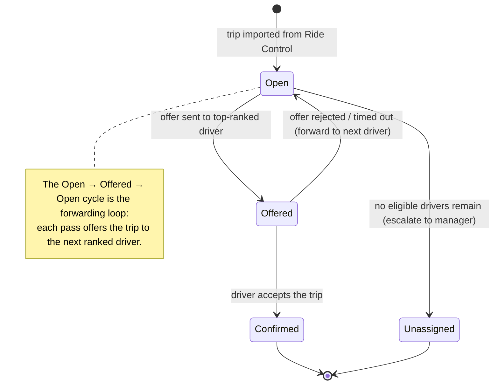
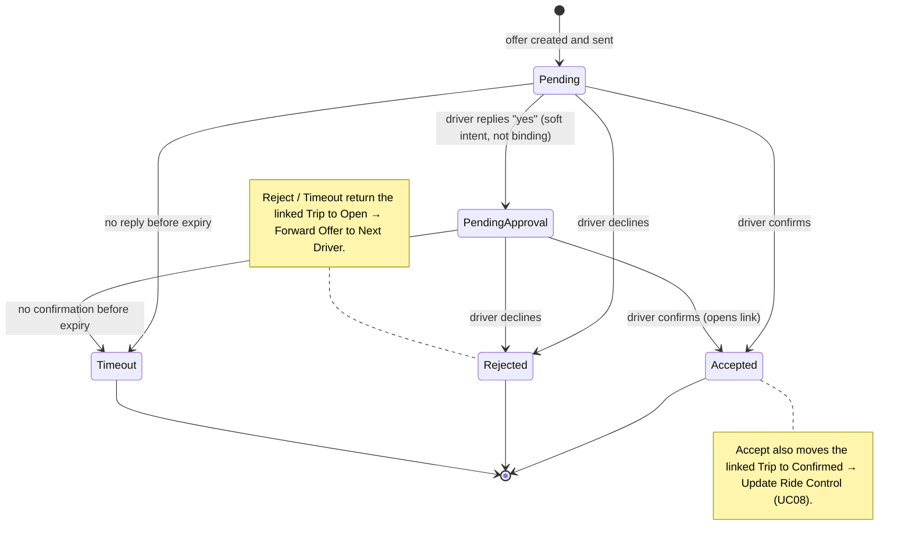

# State Diagrams — Trip & Offer

Grounded **exactly in the implemented code**: [Trip.cs](../../ExternalDriverDispatch/Trip.cs) and [Offer.cs](../../ExternalDriverDispatch/Offer.cs) state-machine verbs, the enums in [Enums.cs](../../ExternalDriverDispatch/Enums.cs), and the stored procedures in [scripts/stored_procedures.sql](../../scripts/stored_procedures.sql).

Per the course two-layer rule (`PATTERNS.md`), each machine is shown twice:
1. **Analysis level** — the diagram. Behavioural, technology-neutral state and transition names (no class / method / SP names).
2. **Implementation Notes** — design level, clearly labelled. Maps every transition to its verb method, guard, stored procedure, and side-effect.

The system has **two** state-bearing entities. They are modelled as **two separate machines** — `Trip` (the job) and `Offer` (one outreach attempt to one driver). They are *not* merged into one diagram: a trip can spawn many offers along the forwarding chain, so their lifecycles are independent. `LoginPanel`, `SettingsPanel`, and the reports are stateless technical screens and have no state machine.

VP-ready source: [state_trip.puml](visual-paradigm-import/plantuml-diagrams/state_trip.puml) · [state_offer.puml](visual-paradigm-import/plantuml-diagrams/state_offer.puml).

---

## 1. Trip — lifecycle

### Analysis-level diagram

States = the `TripStatus` enum display labels: **Open · Offered · Confirmed · Unassigned**.

### Implementation Notes (design level)

| # | Transition | Trigger | Method · guard | Stored procedure | Side-effect |
|---|---|---|---|---|---|
| T1 | Open → Offered | dispatcher / board sends the offer | `Trip.offer()` · guard `status == open` | `sp_Trip_offer` | — |
| T2 | Offered → Confirmed | driver accepts | `Offer.accept()` sets `trip → confirmed`; standalone verb `Trip.confirm()` · guard `status == offered` also exists | `sp_Offer_accept` (and `sp_Trip_confirm`) | the accepting Offer → `accepted`; triggers **Update Ride Control (UC08)** |
| T3 | Offered → Open | offer rejected or timed out | `Trip.requeue()` · guard `status == offered`; also `Offer.reject()` / `Offer.timeout()` set `trip → open` | `sp_Trip_requeue` / `sp_Offer_reject` / `sp_Offer_timeout` | triggers **Forward Offer to Next Driver** |
| T4 | Open → Unassigned | forwarding exhausted all eligible drivers | `Trip.unassign()` · guard `status == open` | `sp_Trip_unassign` | manager escalation (WhatsApp) |

> **Per the code, honest note:** `TripStatus` also declares `completed` and `cancelled`, but **no state-machine verb transitions into them** — they exist in the enum and are unused by the lifecycle methods. `Confirmed` is the terminal success state; `Unassigned` is the terminal escalation state.

---

## 2. Offer — one outreach attempt

### Analysis-level diagram

States = the `OfferStatus` enum display labels: **Pending · Pending Approval · Accepted · Rejected · Timeout**.

### Implementation Notes (design level)

| # | Transition | Trigger | Method · guard | Stored procedure | Trip side-effect |
|---|---|---|---|---|---|
| O1 | Pending → Pending Approval | driver texts "yes" (interpreted intent) | `Offer.markPendingApproval()` · guard `status == pending` | `sp_Offer_pending_approval` | none — trip stays `offered` |
| O2 | Pending / Pending Approval → Accepted | driver confirms | `Offer.accept()` · guard `status ∈ {pending, pending_approval}` | `sp_Offer_accept` | trip → `confirmed` (UC08) |
| O3 | Pending / Pending Approval → Rejected | driver declines | `Offer.reject()` · guard `status ∈ {pending, pending_approval}` | `sp_Offer_reject` | trip → `open` (forward) |
| O4 | Pending / Pending Approval → Timeout | expiry reached, no reply | `Offer.timeout()` · guard `status ∈ {pending, pending_approval}` | `sp_Offer_timeout` | trip → `open` (forward) |

> Each `accept` / `reject` / `timeout` SP runs as one `BEGIN TRAN … COMMIT` updating **both** the Offer **and** its Trip; the C# verb mirrors both in memory (see [Offer.cs:152](../../ExternalDriverDispatch/Offer.cs#L152)).

> **Per the code, honest note:** `OfferStatus` also declares `approval_timeout` and `cancelled`, but **no verb transitions into them** (declared, unused). `Accepted` / `Rejected` / `Timeout` are terminal — a new outreach is a *new* Offer, not a reset of this one (preserves the contacted-driver history the forwarding logic relies on).

---

## 3. How the two machines interlock

The Trip's `Offered → …` transitions are **driven by** the Offer's terminal transitions:

| Offer reaches | Trip is driven to | Then |
|---|---|---|
| Accepted (O2) | Confirmed (T2) | Update Ride Control (UC08); trip is done |
| Rejected (O3) | Open (T3) | Forward Offer to Next Driver — a **new** Offer (Pending) is created |
| Timeout (O4) | Open (T3) | same forwarding path |

A trip therefore loops `Open → Offered → Open` once per declined/expired driver, and lands in `Confirmed` (someone accepted) or `Unassigned` (the ranked list was exhausted, T4).

## 4. What is deliberately *not* a state

Computing the drive distance / duration (Maps enrichment, `DispatchService.EnrichTrip`) is an **internal action** that runs while the trip is `Open` (at region assignment); it does not change `TripStatus`, so it is not a state. In **offline** mode the provider returns a deterministic `60 min / 0 km` with no network call — still not a state, just a different value written by the same action.

---

## 5. Importing into Visual Paradigm

Same workflow as the other diagrams (see [visual-paradigm-import/README.md](visual-paradigm-import/README.md)):

- **Editable import:** install the bundled PlantUML plugin (*Help → Install Plugin → Install from a zip*: `visual-paradigm-import/plugin-plantuml-vp-v1.0.0.zip`), then import `state_trip.puml` and `state_offer.puml` from the `plantuml-diagrams` folder. Each `@startuml` becomes one State Machine Diagram page.
- **Stable visual:** render the two `.puml` files to PNG and add them as diagram pages, as was done for the existing `Implementation UML - …` pages in `implementation-uml-visuals.vpp`.
